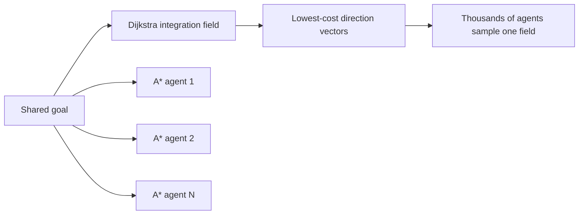

<div align="center">
  

  # Flow Field Pathfinding

  **One shared field. Thousands of agents. One destination.**

  An interactive algorithm case study comparing a reusable flow field with independent A* searches for large RTS and simulation crowds.

  [](https://www.typescriptlang.org/)
  [](https://vite.dev/)
  [](https://developer.mozilla.org/en-US/docs/Web/API/Canvas_API)
  [](https://nodejs.org/)

  [Quick start](#quick-start) · [How it works](#how-it-works) · [Comparison](#comparison-methodology) · [Controls](#controls)
</div>

---

## Why This Exists

Independent A* is a strong general-purpose path search, but a crowd can repeat much of the same work when thousands of agents share one destination. A flow field changes the ownership of that work:

- build one integration field outward from the destination
- derive one direction vector for every reachable cell
- let every agent sample the vector beneath it

This repository makes that tradeoff visible. It is designed for RTS, crowd, and simulation-engine scenarios where many agents need coherent global guidance.

## Scenario Profile

| Setting | Default |
| --- | ---: |
| Grid | `64 × 40` cells |
| Logical canvas | `960 × 600` |
| Crowd | `1,200` agents |
| Maximum crowd | `5,000` agents |
| Destination count | `1` shared goal |
| Terrain | Normal, blocked, and weighted rough cells |
| Movement | Shared vectors or private A* waypoints |

The included scenarios are deterministic so repeated comparisons are more meaningful than a fresh random map on every load.

## Quick Start

```bash
git clone https://github.com/LilBoyWander/flow-field-pathfinding.git
cd flow-field-pathfinding
npm install
npm run dev
```

Open the local URL printed by Vite.

### Available Scripts

| Command | Purpose |
| --- | --- |
| `npm run dev` | Start the Vite development server |
| `npm run check` | Type-check without emitting files |
| `npm run build` | Type-check and create a production build |
| `npm run preview` | Preview the production build locally |

## How It Works



### Flow Field

1. A priority-queue Dijkstra expansion starts at the destination.
2. Every reachable cell records its cheapest accumulated terrain cost.
3. Each cell points toward the neighboring cell with the lowest integration value.
4. Agents sample that shared direction and steer toward the destination.

The field is rebuilt when the destination or terrain changes. Agent count does not change the field-build cost.

### Independent A*

Each agent runs an actual A* search from its current cell to the shared destination. The implementation reuses scratch buffers to reduce allocation noise, but every reported route still performs its own search and stores its own waypoint array.

## Comparison Methodology

The **Benchmark both planners** action runs:

- one real flow-field build
- one real A* search per reported route

The A* comparison uses up to `3,000` current agents so the browser remains responsive enough to report the result. The interface states the exact number of routes measured.

Reported planner times do not include:

- crowd movement
- Canvas rendering
- local collision avoidance
- network or server work

> [!IMPORTANT]
> This is not a claim that flow fields replace A* or NavMesh navigation. Flow fields are strongest when many agents share destinations and terrain costs. A* remains appropriate for individual queries. NavMesh describes navigable space and can still use graph search or shared guidance over its regions.

## Controls

| Control | Effect |
| --- | --- |
| **Shared flow field** | Builds one integration and direction field |
| **Independent A\*** | Builds and stores one path for each agent |
| **Agent count** | Adjusts the crowd from `100` to `5,000` |
| **Movement speed** | Changes simulation speed without affecting planner timing |
| **Terrain scenario** | Loads a deterministic benchmark layout |
| **Goal tool** | Click to move the shared destination |
| **Wall tool** | Paints blocked cells |
| **Rough cost tool** | Paints traversable cells with a higher movement cost |
| **Erase tool** | Restores normal terrain |
| **Flow vectors** | Shows the shared direction field |
| **Integration heatmap** | Shows accumulated cost to the goal |
| **A\* route sample** | Draws up to 28 private A* paths |
| <kbd>F</kbd> / <kbd>A</kbd> | Switch planner mode |
| <kbd>Space</kbd> | Pause or resume movement |

Right-clicking the canvas always moves the destination.

## Telemetry

The application separates planning, simulation, and rendering:

- animation-frame interval and derived FPS
- crowd movement-update time
- Canvas render time
- latest navigation rebuild time
- nodes expanded
- routes built
- unreachable cells or agents
- agents that reached the destination

Browser timing is useful for relative exploration, not a substitute for controlled native-engine profiling.

## Project Structure

```text
.
├── prototype/
│   └── flow-field-v4.html       # Preserved original single-file experiment
├── public/
│   └── favicon.svg
├── src/
│   ├── algorithms/
│   │   ├── aStar.ts             # Independent path search
│   │   ├── flowField.ts         # Integration and vector field
│   │   └── minHeap.ts           # Shared priority queue
│   ├── simulation/
│   │   ├── crowd.ts             # Agent movement and route following
│   │   └── gridMap.ts           # Typed terrain-cost grid and presets
│   ├── app.ts                   # UI, benchmark orchestration, rendering
│   ├── main.ts                  # Entry point
│   └── style.css                # Responsive case-study visual system
├── index.html
├── package.json
└── tsconfig.json
```

### Recommended Reading Order

1. [`src/algorithms/flowField.ts`](./src/algorithms/flowField.ts)
2. [`src/algorithms/aStar.ts`](./src/algorithms/aStar.ts)
3. [`src/simulation/crowd.ts`](./src/simulation/crowd.ts)
4. [`src/app.ts`](./src/app.ts)

## Implementation Notes

- Grid costs, integration values, vectors, and planner scratch state use typed arrays.
- Both planners support weighted terrain and diagonal movement.
- Diagonal corner-cutting through blocked cells is rejected.
- A* reuses its heap and score buffers between searches.
- Presets use deterministic generation for repeatable workloads.
- Canvas pointer coordinates are converted back into logical grid space.
- The original prototype is retained as implementation history, not used by the production app.

## Deliberate Limitations

- Agents do not perform local collision avoidance.
- All agents share one global terrain-cost model.
- Dynamic edits rebuild the entire field rather than incrementally repairing it.
- Canvas 2D keeps the rendering code approachable; very large production crowds may require GPU instancing.
- The project demonstrates one shared destination. Multiple goals typically require multiple fields or a higher-level strategy.

## Deployment

This is a static Vite application. For Coolify:

- Build pack: `Nixpacks`
- Static site: enabled
- Build command: `npm run build`
- Publish directory: `dist`
- Start command: blank

---

<div align="center">
  Case study 002: shared navigation fields for crowd-scale movement.
</div>
